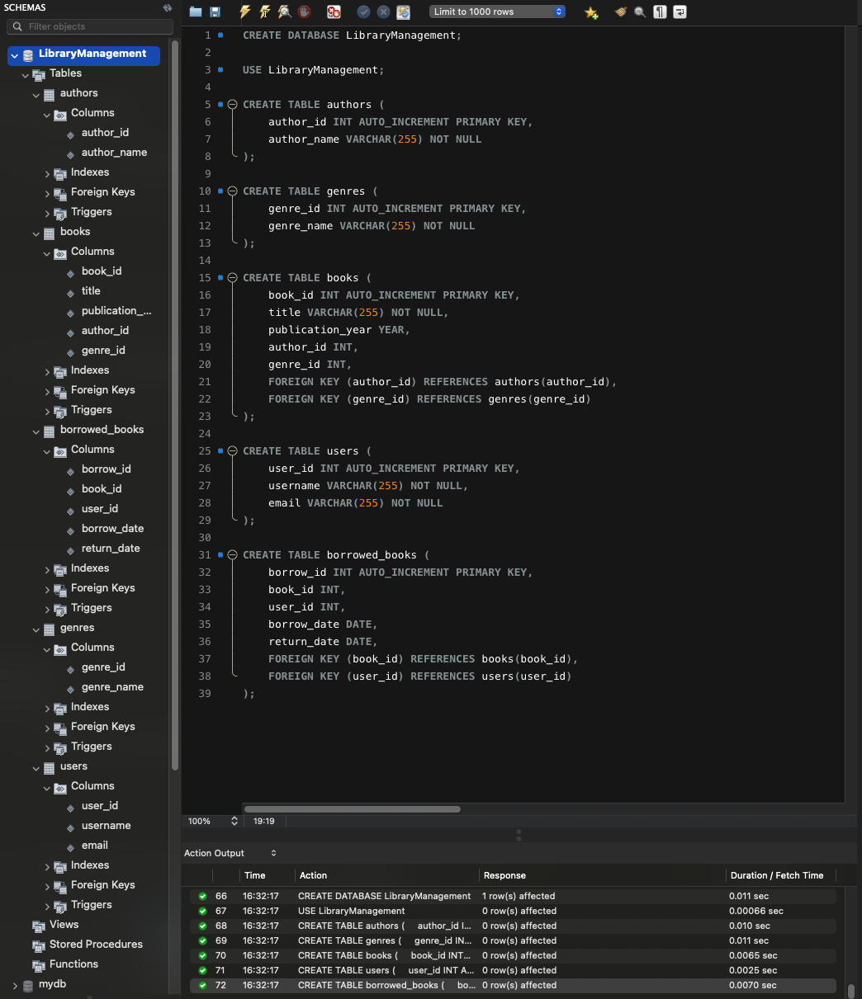
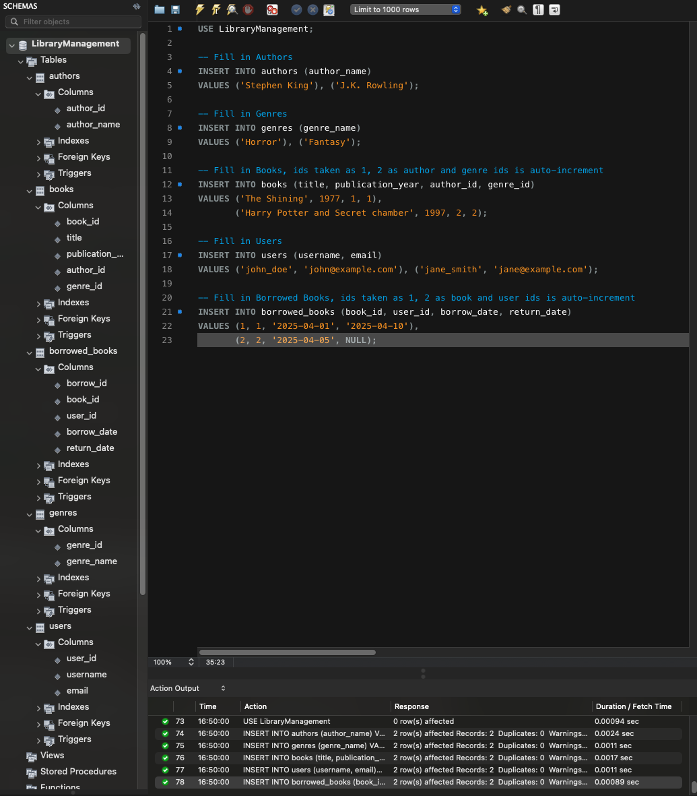
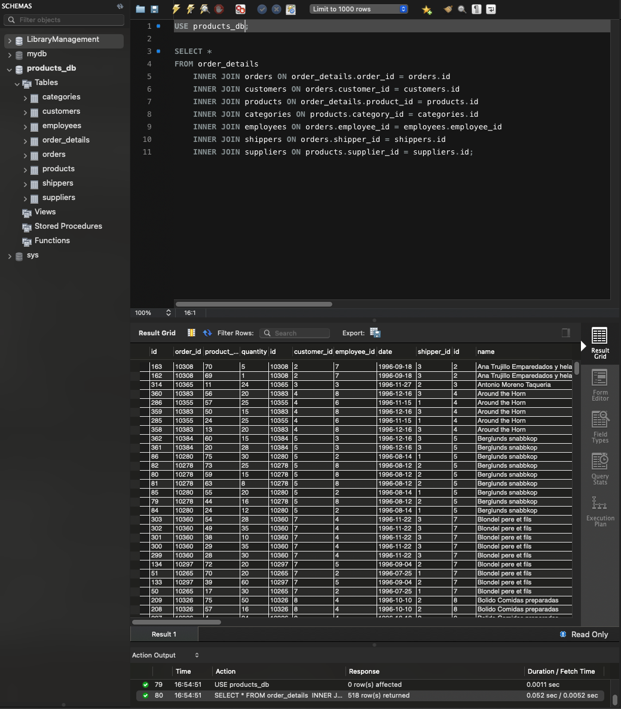
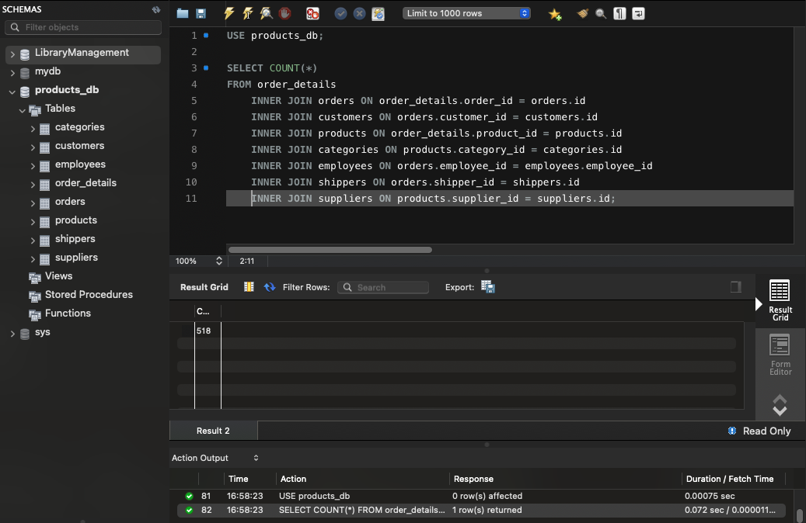
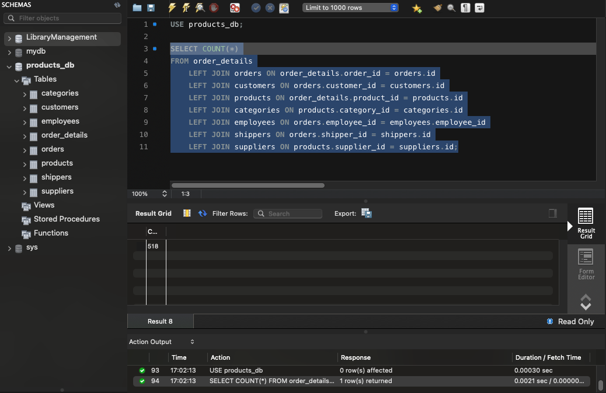
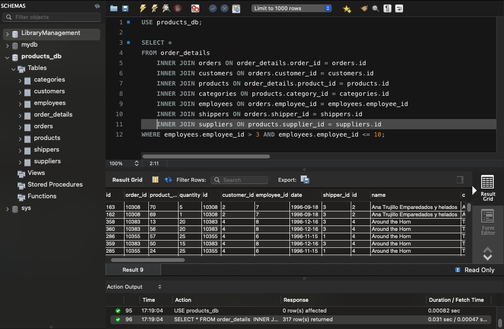
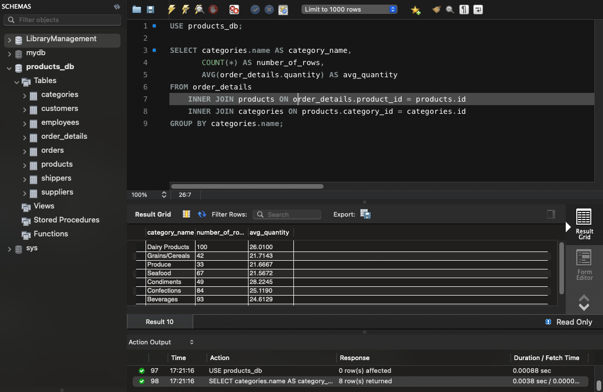
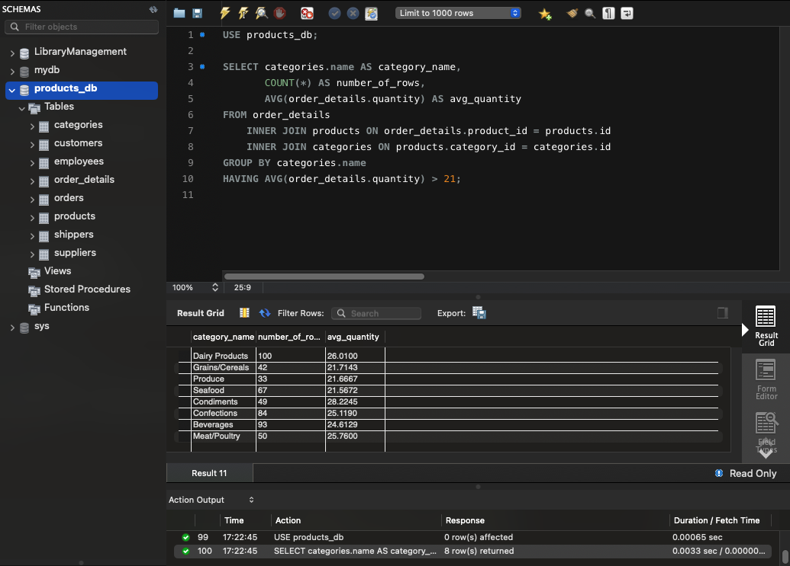
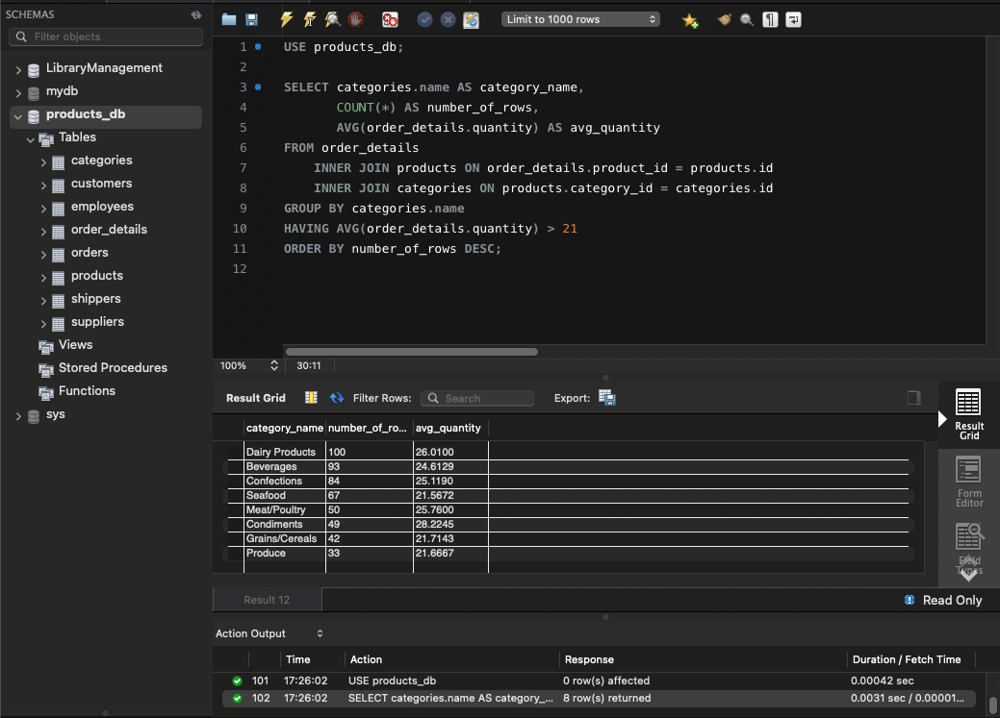
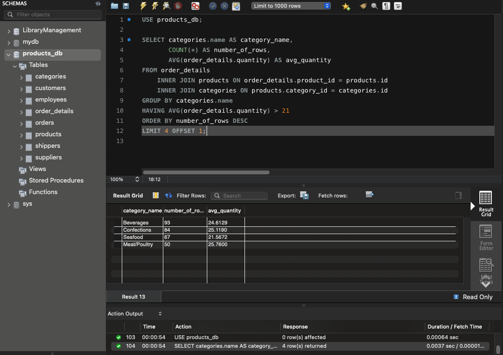

# Homework 4: DML та DDL команди. Складні SQL вирази

## Завдання

1. Створіть базу даних для керування бібліотекою книг згідно зі структурою, наведеною нижче. Використовуйте DDL-команди для створення необхідних таблиць та їх зв'язків.
Структура БД:
    1. Назва схеми — “LibraryManagement”

    2. Таблиця "authors":

        author_id (INT, автоматично зростаючий PRIMARY KEY)
        author_name (VARCHAR)

    3. Таблиця "genres":

        genre_id (INT, автоматично зростаючий PRIMARY KEY)
        genre_name (VARCHAR)

    4. Таблиця "books":

        book_id (INT, автоматично зростаючий PRIMARY KEY)
        title (VARCHAR)
        publication_year (YEAR)
        author_id (INT, FOREIGN KEY зв'язок з "Authors")
        genre_id (INT, FOREIGN KEY зв'язок з "Genres")

    5. Таблиця "users":

        user_id (INT, автоматично зростаючий PRIMARY KEY)
        username (VARCHAR)
        email (VARCHAR)

    6. Таблиця "borrowed_books":

        borrow_id (INT, автоматично зростаючий PRIMARY KEY)
        book_id (INT, FOREIGN KEY зв'язок з "Books")
        user_id (INT, FOREIGN KEY зв'язок з "Users")
        borrow_date (DATE)
        return_date (DATE)

2. Заповніть таблиці простими видуманими тестовими даними. Достатньо одного-двох рядків у кожну таблицю.

3. Перейдіть до бази даних, з якою працювали у темі 3. Напишіть запит за допомогою операторів FROM та INNER JOIN, що об’єднує всі таблиці даних, які ми завантажили з файлів: order_details, orders, customers, products, categories, employees, shippers, suppliers. Для цього ви маєте знайти спільні ключі.

    Перевірте правильність виконання запиту.

4. Виконайте запити, перелічені нижче.

  - Визначте, скільки рядків ви отримали (за допомогою оператора COUNT).
  - Змініть декілька операторів INNER на LEFT чи RIGHT. Визначте, що відбувається з кількістю рядків. Чому? Напишіть відповідь у текстовому файлі.
  - На основі запита з пункта 3 виконайте наступне: оберіть тільки ті рядки, де employee_id > 3 та ≤ 10.
  - Згрупуйте за іменем категорії, порахуйте кількість рядків у групі, середню кількість товару (кількість товару знаходиться в order_details.quantity)
  - Відфільтруйте рядки, де середня кількість товару більша за 21.
  - Відсортуйте рядки за спаданням кількості рядків.
  - Виведіть на екран (оберіть) чотири рядки з пропущеним першим рядком.

## Виконання

### 1. Створення бази даних LibraryManagement

```sql
CREATE DATABASE LibraryManagement;

USE LibraryManagement;

CREATE TABLE authors (
    author_id INT AUTO_INCREMENT PRIMARY KEY,
    author_name VARCHAR(255) NOT NULL
);

CREATE TABLE genres (
    genre_id INT AUTO_INCREMENT PRIMARY KEY,
    genre_name VARCHAR(255) NOT NULL
);

CREATE TABLE books (
    book_id INT AUTO_INCREMENT PRIMARY KEY,
    title VARCHAR(255) NOT NULL,
    publication_year YEAR,
    author_id INT,
    genre_id INT,
    FOREIGN KEY (author_id) REFERENCES authors(author_id),
    FOREIGN KEY (genre_id) REFERENCES genres(genre_id)
);

CREATE TABLE users (
    user_id INT AUTO_INCREMENT PRIMARY KEY,
    username VARCHAR(255) NOT NULL,
    email VARCHAR(255) NOT NULL
);

CREATE TABLE borrowed_books (
    borrow_id INT AUTO_INCREMENT PRIMARY KEY,
    book_id INT,
    user_id INT,
    borrow_date DATE,
    return_date DATE,
    FOREIGN KEY (book_id) REFERENCES books(book_id),
    FOREIGN KEY (user_id) REFERENCES users(user_id)
);
```



Вибрати тільки стовпчики `name`, `phone` з таблиці `shippers`

```sql
SELECT name, phone FROM shippers;
```


### 2. Наповнення таблиць тестовими даними

```sql
USE LibraryManagement;

INSERT INTO authors (author_name)
VALUES ('Stephen King'), ('J.K. Rowling');

INSERT INTO genres (genre_name)
VALUES ('Horror'), ('Fantasy');

INSERT INTO books (title, publication_year, author_id, genre_id)
VALUES ('The Shining', 1977, 1, 1),
       ('Harry Potter and Secret chamber', 1997, 2, 2);
       
INSERT INTO users (username, email)
VALUES ('john_doe', 'john@example.com'), ('jane_smith', 'jane@example.com');

INSERT INTO borrowed_books (book_id, user_id, borrow_date, return_date)
VALUES (1, 1, '2025-04-01', '2025-04-10'),
       (2, 2, '2025-04-05', NULL);
```



### 3. Об'єднання таблиць з попереднього ДЗ

```sql
SELECT *
FROM order_details
	INNER JOIN orders ON order_details.order_id = orders.id
	INNER JOIN customers ON orders.customer_id = customers.id
	INNER JOIN products ON order_details.product_id = products.id
	INNER JOIN categories ON products.category_id = categories.id
	INNER JOIN employees ON orders.employee_id = employees.employee_id
	INNER JOIN shippers ON orders.shipper_id = shippers.id
	INNER JOIN suppliers ON products.supplier_id = suppliers.id;
```



### 4. Додаткові запити

#### 4.1. Підрахунок кількості рядків

```sql
SELECT COUNT(*)
FROM order_details
	INNER JOIN orders ON order_details.order_id = orders.id
	INNER JOIN customers ON orders.customer_id = customers.id
	INNER JOIN products ON order_details.product_id = products.id
	INNER JOIN categories ON products.category_id = categories.id
	INNER JOIN employees ON orders.employee_id = employees.employee_id
	INNER JOIN shippers ON orders.shipper_id = shippers.id
	INNER JOIN suppliers ON products.supplier_id = suppliers.id;
```



#### 4.2. Зміна INNER JOIN на LEFT JOIN або RIGHT JOIN

```sql
SELECT COUNT(*)
FROM order_details
	LEFT JOIN orders ON order_details.order_id = orders.id
  LEFT JOIN customers ON orders.customer_id = customers.id
  LEFT JOIN products ON order_details.product_id = products.id
  LEFT JOIN categories ON products.category_id = categories.id
  LEFT JOIN employees ON orders.employee_id = employees.employee_id
  LEFT JOIN shippers ON orders.shipper_id = shippers.id
  LEFT JOIN suppliers ON products.supplier_id = suppliers.id;
```

Я спробував різні комбінації заміни і навіть спробува замінити всі `INNER JOIN` на `LEFT JOIN`, але результат був один і той самий - **518** записів.

Це означає, що у таблицях немає "висячих" даних — усі записи в таблицях мають відповідності в інших таблицях.

Якщо були б записи, які не мають відповідності, то `LEFT JOIN` або `RIGHT JOIN` дали б більше рядків (бо вони зберігають "лівий" або "правий" бік приєднання, навіть без відповідності).



#### 4.3. Фільтрація за employee_id

```sql
SELECT *
FROM order_details
	INNER JOIN orders ON order_details.order_id = orders.id
	INNER JOIN customers ON orders.customer_id = customers.id
	INNER JOIN products ON order_details.product_id = products.id
	INNER JOIN categories ON products.category_id = categories.id
	INNER JOIN employees ON orders.employee_id = employees.employee_id
	INNER JOIN shippers ON orders.shipper_id = shippers.id
	INNER JOIN suppliers ON products.supplier_id = suppliers.id
WHERE employees.employee_id > 3 AND employees.employee_id <= 10;
```



#### 4.4. Групування за іменем категорії

```sql
SELECT categories.name AS category_name,
       COUNT(*) AS number_of_rows,
       AVG(order_details.quantity) AS avg_quantity
FROM order_details
	INNER JOIN products ON order_details.product_id = products.id
	INNER JOIN categories ON products.category_id = categories.id
GROUP BY categories.name;
```



#### 4.5. Фільтрація, де середня кількість товару > 21

```sql
SELECT categories.name AS category_name,
       COUNT(*) AS number_of_rows,
       AVG(order_details.quantity) AS avg_quantity
FROM order_details
	INNER JOIN products ON order_details.product_id = products.id
	INNER JOIN categories ON products.category_id = categories.id
GROUP BY categories.name
HAVING AVG(order_details.quantity) > 21;
```



#### 4.6. Сортування за спаданням кількості рядків

```sql
SELECT categories.name AS category_name,
       COUNT(*) AS number_of_rows,
       AVG(order_details.quantity) AS avg_quantity
FROM order_details
  INNER JOIN products ON order_details.product_id = products.id
  INNER JOIN categories ON products.category_id = categories.id
GROUP BY categories.name
HAVING AVG(order_details.quantity) > 21
ORDER BY number_of_rows DESC;
```



#### 4.7. Пропустити перший рядок і вивести наступні чотири

```sql
SELECT categories.name AS category_name,
       COUNT(*) AS number_of_rows,
       AVG(order_details.quantity) AS avg_quantity
FROM order_details
  INNER JOIN products ON order_details.product_id = products.id
  INNER JOIN categories ON products.category_id = categories.id
GROUP BY categories.name
HAVING AVG(order_details.quantity) > 21
ORDER BY number_of_rows DESC
LIMIT 4 OFFSET 1;
```


